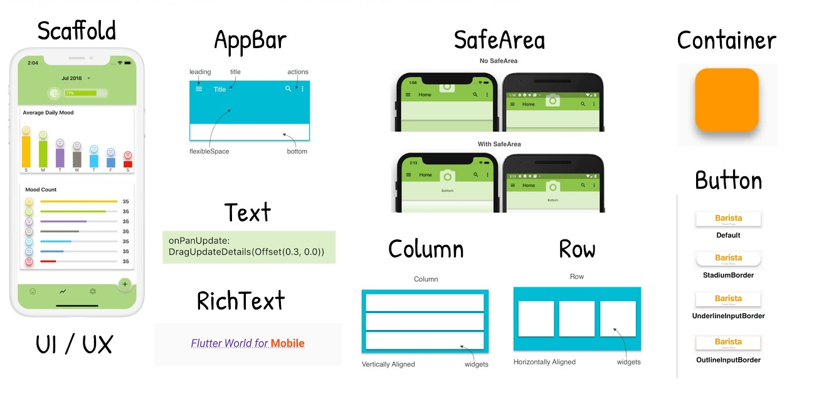
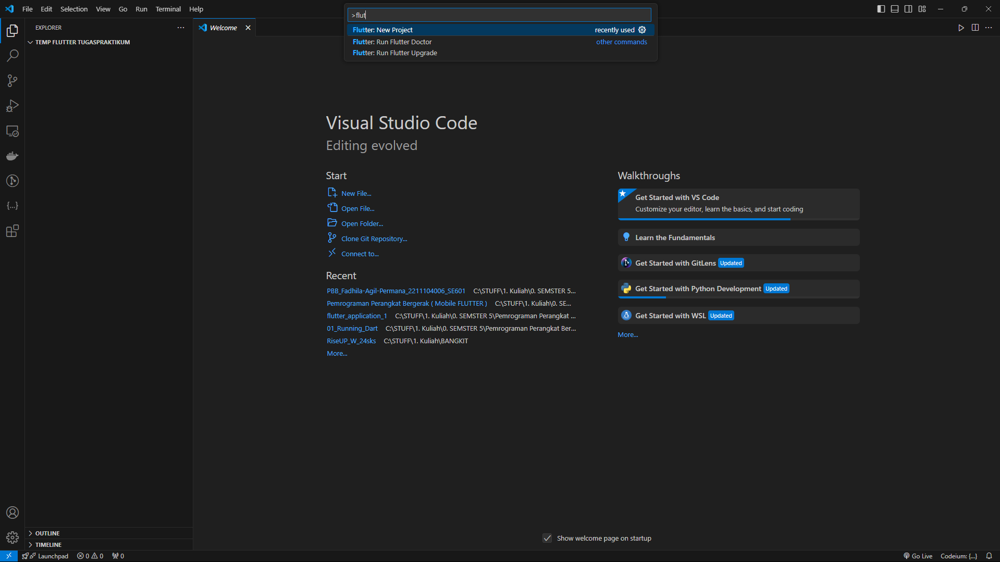
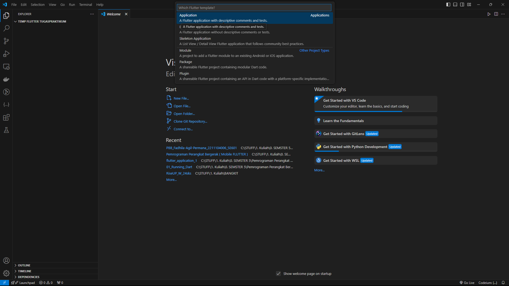
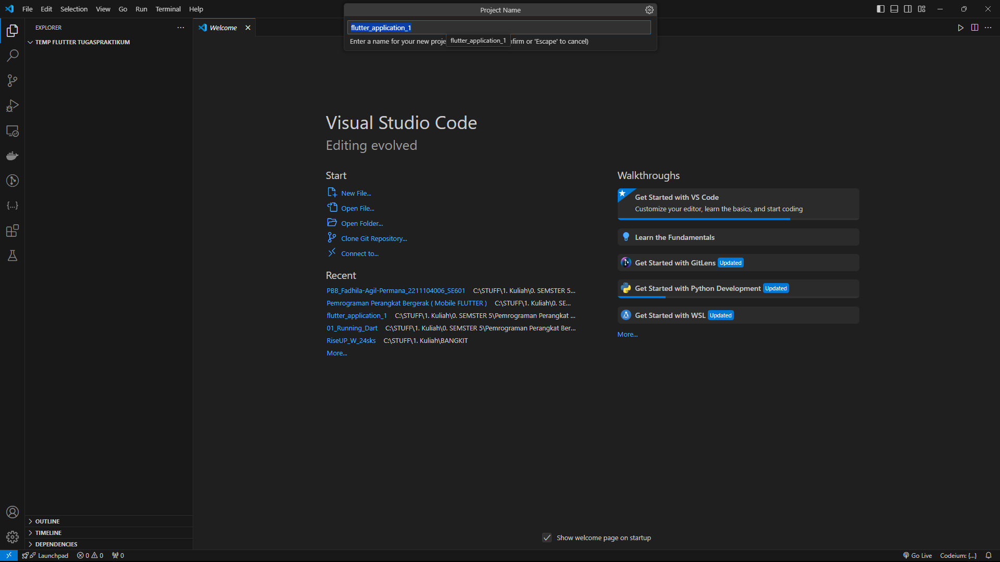
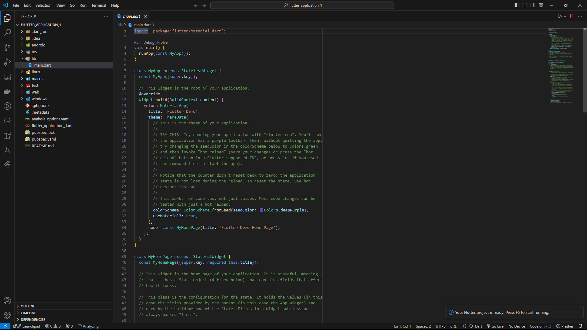
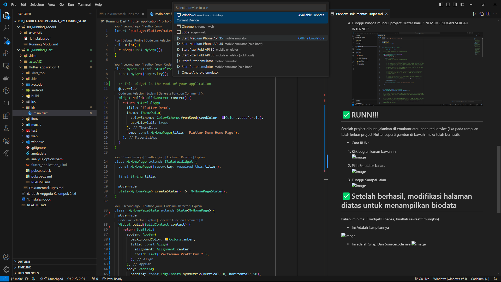
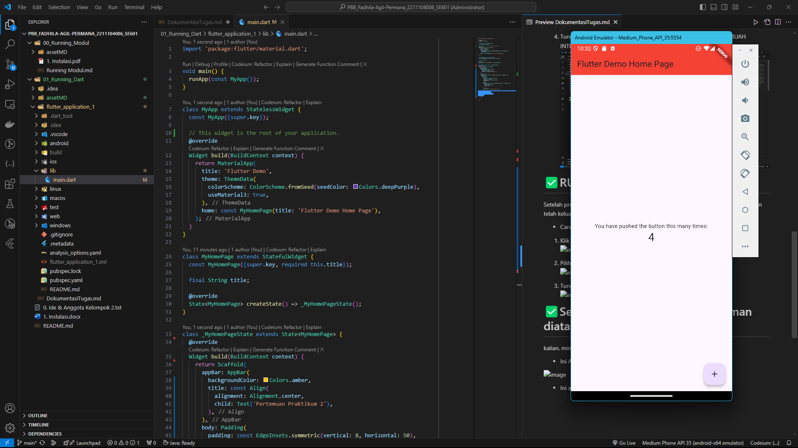
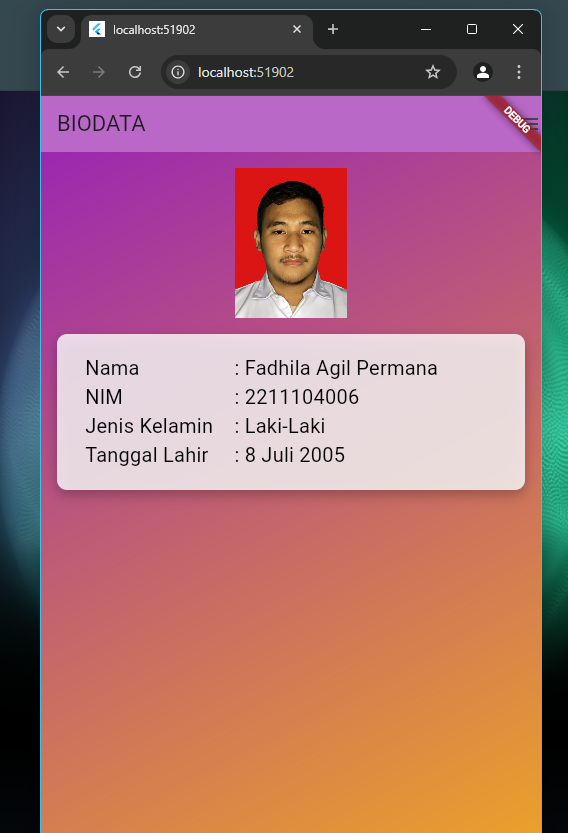

<li> Nama : Fadhila Agil Permana
<li> NIM : 2211104006
<li> Kelas : SE061

 

# 

  

 

<!-- ============================================================== -->
# ✅ Jelaskan apa itu Dart & Flutter beserta contoh widget yang ada pada Flutter.
<li>Apa itu dart ?

[_Dart is a client-optimized language for developing fast apps on any platform. Its goal is to offer the most productive programming language for multi-platform development, paired with a flexible execution runtime platform for app frameworks._](https://flutter.dev/)

<ol>
<al> JADI.  
Dart adalah bahasa yang dioptimalkan untuk klien untuk mengembangkan aplikasi yang cepat di platform apa pun. Tujuannya adalah menawarkan bahasa pemrograman yang paling produktif untuk pengembangan multi-platform, dipasangkan dengan platform runtime eksekusi yang fleksibel untuk kerangka kerja aplikasi.
</ol>

  

<li>Apa itu Flutter ?

[_Flutter is an open source framework for building beautiful, natively compiled, multi-platform applications from a single codebase._](https://flutter.dev/)

<ol>
<al> JADI.  
Flutter adalah kerangka kerja sumber terbuka untuk membangun aplikasi multi-platform yang indah dan dikompilasi secara native dari satu basis kode.
</ol>

  

<li>Contoh-contoh widget nya ? 
<ol>
<al> Widget adalah elemen dasar yang digunakan untuk membangun antarmuka
pengguna (UI). Setiap elemen visual dalam aplikasi Flutter, seperti tombol, teks,
gambar, atau layout, direpresentasikan sebagai widget.
</ol>

  

<!-- ============================================================== -->
# ✅ Buatlah sebuah project Flutter.
 * Ini cara membuat sebuah project Flutter, melalui vscode.
<ol>
<li>Didalam VScode lakukan "CTRL + SHIFT + P" dan ketik "FLutter: New Project".

  

<li>Setelah itu pilih "Application" yang ada di bawah.

  

<li>Masukkan nama folder atau nama dari projek kalian.

  

<li>Tunggu hingga muncul project Flutter baru. "INI MEMERLUKAN SEBUAH INTERNET"

  

</ol>

<!-- ============================================================== -->
# ✅RUNN!!!
Setelah project dibuat, jalankan di emulator atau pada real device (jika
pada tampilan telah keluar project Flutter seperti gambar di bawah, maka
telah berhasil).

* Cara RUN :
<ol>
<li>Klik bagian kanan bawah ini.

  

<li>Pilih Emulator kalian. (Punyaku Beberapanya sudah di download dari Android Studio)

  

<li>Tunggu Sampai Jalan

  

</ol>

<!-- ============================================================== -->

# ✅Setelah berhasil, modifikasi halaman diatas untuk menampilkan biodata
kalian, minimal 5 widget!! (bebas, buatlah sekreatif mungkin).
* Ini Adalah Tampilannya 

  

